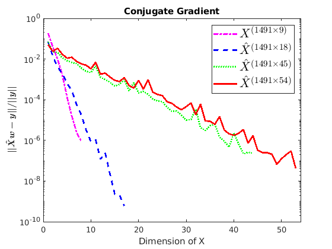

# ComputationalMathematicsProject
The aim of this project is to propose a solution of the following linear system, taken from the ML Cup by prof. Micheli:
$\min_{w} ||\hat{X}w-y||$
where $\hat{X}$ is the matrix obtained by concatenating the (tall thin) matrix from the ML-cup dataset, called $X$, with a few additional columns containing functions of the features of the dataset, and $y$ are the two output columns.

The first algorithm implemented and discussed is the \textbf{Conjugate Gradient Method}, which needs some initial conditions to be met, so the first section will discuss the stage setting. 
The second part of the report will regard the \textbf{QR Factorization with Householder reflectors} in the variant where one does not form the matrix $Q$, but stores the Householder vectors $u_k$ and uses them to perform (implicitly) products with $Q$ and $Q^T$.

